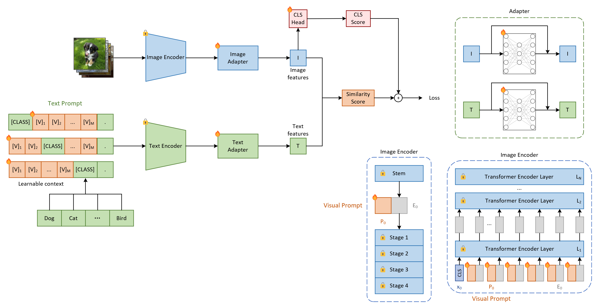

# Visual Language Prompt Learning for Few-Shot Image Classification

This project is base on [KaiyangZhou/CoOp](https://github.com/KaiyangZhou/CoOp).

## How to Install
This code is built on top of the awesome toolbox [Dassl.pytorch](https://github.com/KaiyangZhou/Dassl.pytorch) so you need to install the `dassl` environment first. Simply follow the instructions described [here](https://github.com/KaiyangZhou/Dassl.pytorch#installation) to install `dassl` as well as PyTorch. After that, run `pip install -r requirements.txt` under `CoOp/` to install a few more packages required by [CLIP](https://github.com/openai/CLIP) (this should be done when `dassl` is activated). Then, you are ready to go.

Follow [DATASETS.md](DATASETS.md) to install the datasets.

## How to Run

Click a paper below to see the detailed instructions on how to run the code to reproduce the results.

* [Visual Language Prompt Learning for Few-Shot Image Classification](VLPL.md)
